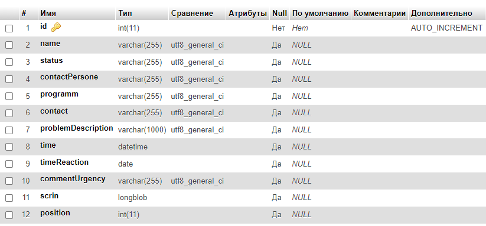
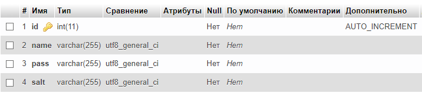

# **Coursework** #
# **Информационная система - Service desk**
--------------------------

#### **Цель работы**
Разработать информационную систему `Service desk` - прием и обработка обращений пользователей ERP систем.

-------------------------
#### **Описание системы**

##### **Пользовательские роли**

В системе предусмотрены две роли:
* **Клиент** 
    * Создание новой заяки 
    * Просмотор ранее отправленных
* **Администратора** 
    * Просмотр всех заявок
    * Обработка заявок
    * Регистрация новых пользователей
    * Сброс пароля 

#### **Пользовательские сценарии**

**Клиент**

При переходе на сайт, Клиенту необходимо пройти авторизацию по ранее выданной связке - `логин:пароль`. Далее Клиента встречает преветсвенное сообщение с пояснением функционала сервиса: 
>Уважаемый Клиент!
Мы рады приветствовать Вас в личном кабинете нашего сайта. Здесь Вы можете отправить заявку на оказание услуг, обратиться за консультацией по программам, которые мы обслуживаем. Так же Вы можете просмотреть историю своих заявок и запросов на консультации.
Для отправки заявки выберите в правом меню кнопку `Добавить заявку`.
Для просмотра своих заявок в правом меню выберите кнопку `Мои заявки`.

После нажатия кнопки `Добавить заявку`, Клиента переводит на страницу с формой оформления новой заявки. После заполнения которой он может отправить ее на рассмотрение.

После нажатия кнопки `Мои заявки`, Клиента переводит на страницу, где в виде таблицы сформирован список всех ранее отправленных заявок. При нажатии на `Номер/Дата` Пользователь может просмотреть ранее заполненую форму. В случае если был загружен скриншот ошибки, у Клиента появляется ссылка на просмотр изображения. 

**Администратор**

Панель администратора находится по отдельной ссылке и не видна обычным клиентам (`/admin`). После прохождения авторизации доступны следующие кнопки:
* `Регистрация пользователя`
* `Просмотр заявок`
* `Смена пароля`
* `Выход`

В разделе `Регистрация пользователя` открывается форма регистрации нового пользователя.

В разделе `Просмотр заявок` Администратору выводится в виде таблице список всех отправленных заявок. Столбцы таблицы:
* `Статус` *(срочный/обычный)*
* `Номер/Дата` *(id/дата подачи заявки)*
* `Клиент` *(имя)*
* `Содержание` *(описание проблемы)*
* `Состояние` *(открыто/закрыто)*

При нажатии на `Номер/Дата` Администратор может просмотреть форму заявки, связаться с клиентом (через оставленные контакные данные) для помощи в решении его проблемы. После решения Администратор нажимает на кнопку `Закрыть задачу`, после чего у заявки меняется статус на *закрыто*. 

В разделе `Смена пароля` открывается форма смены пароля.

-------------------
#### **Компоненты системы**
Используемый стек технологий:
* Apache 2.4.46
* PHP 7.3.21
* JavaScript
* MySQL 14.4
* JQuery 3.4.1
* Bootstrap 4.5.2

--------
#### **Схема базы данных**
*Схема таблицы запросов*

*Схема таблицы авторизации*

